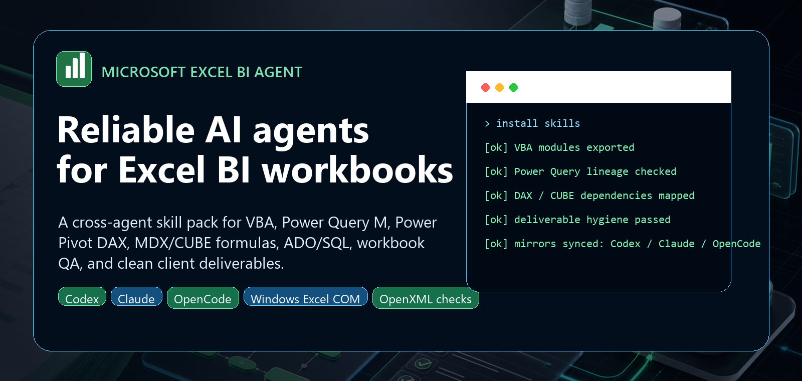

# Microsoft Excel BI Agent



[](https://github.com/90le/microsoft-excel-bi-agent/releases)
[](LICENSE)
[](.agents/skills)
[](docs/install-and-sync.md)

**Make AI agents reliable on real Microsoft Excel BI workbooks.**

Microsoft Excel BI Agent is an open-source, cross-agent skill pack for teams that use AI agents to inspect, modify, debug, validate, and publish Excel BI workbooks. It covers **Excel VBA**, **Power Query M**, **Power Pivot DAX**, **MDX/CUBE formulas**, **ADO/SQL**, workbook QA, clean deliverables, Office diagnostics, report building, semantic model review, and sanitized testing fixtures.

It is built for the messy Excel work that generic coding agents usually mishandle: hidden sheets, macro-enabled workbooks, Power Query refresh timing, Data Model boundaries, CUBEVALUE formulas, external links, client-ready `.xlsx` publishing, and Windows Excel COM validation.

## Why It Exists

AI agents can write code, but Excel BI workbooks are not just code. A workbook may contain formulas, VBA, Power Query M, Power Pivot models, CUBE formulas, buttons, named ranges, external links, and hidden process sheets. This package gives agents a practical operating system for that world.

| Use case | What the skill pack adds |
| --- | --- |
| Excel/VBA workbook engineering | Export/import modules, bind buttons, debug compile/runtime errors, preserve workbook structure |
| Power Query M work | Read, edit, refresh, diagnose errors, track lineage, and wait for refresh completion |
| Power Pivot / DAX | Review measures, context behavior, relationships, and Excel Data Model boundaries |
| MDX / CUBE formulas | Explain and audit `CUBEVALUE`, `CUBEMEMBER`, measures, members, and helper-cell references |
| Client deliverables | Freeze formulas, remove links/queries/Data Model dependencies, delete config/process sheets |
| Workbook QA | Audit formulas, hidden sheets, controls, external dependencies, and delivery risk |
| Cross-agent installation | Sync the same skills into Codex, Claude, and OpenCode style folders |

## Included Skills

| Area | Skill |
| --- | --- |
| Routing | `excel-bi-router` |
| VBA and workbook automation | `excel-vba-workbook-engineering` |
| Power Query M | `power-query-m-engineering` |
| Power Pivot DAX | `power-pivot-dax-modeling` |
| MDX / CUBE formulas | `mdx-cubevalue-extraction` |
| ADO / SQL data access | `excel-ado-sql-data-access` |
| Clean Excel deliverables | `excel-deliverable-publisher` |
| Workbook QA | `excel-workbook-qa-auditor` |
| Report building | `excel-report-builder` |
| Office environment diagnostics | `office-environment-diagnostics` |
| Power BI semantic model context | `power-bi-semantic-model` |
| Sanitized test workbooks | `excel-testing-fixtures` |

## Install

Clone the repository:

```bash
git clone https://github.com/90le/microsoft-excel-bi-agent.git
cd microsoft-excel-bi-agent
```

Install as a local Codex plugin:

```powershell
python tools\deploy-local-plugin.py --project-root . --replace --install
```

Sync skills into Codex, Claude, and OpenCode mirrors:

```powershell
python tools\sync-skills.py --project-root . --all-project-mirrors --codex-user --replace
```

macOS, Linux, and Git Bash use slash paths:

```bash
python tools/deploy-local-plugin.py --project-root . --replace --install
python tools/sync-skills.py --project-root . --all-project-mirrors --codex-user --replace
```

You can also give another agent the ready-to-use install prompt:

```text
prompts/one-click-install-prompt.zh-CN.md
```

## Verify

Structural validation, suitable for Windows, macOS, Linux, and Git Bash:

```powershell
python tools\validate-skills.py .
python tools\build_artifact_hygiene_report.py --project-root . --require-pass
python tools\run_release_gate.py --project-root . --profile structural
```

Full runtime validation requires Windows desktop Excel:

```powershell
python tools\run_release_gate.py --project-root .
```

The full gate is for Excel COM, VBA execution, Power Query refresh, Power Pivot/Data Model behavior, providers, and rendered workbook evidence.

## Documentation

- [Project overview](docs/project.md)
- [Install and sync guide](docs/install-and-sync.md)
- [Task recipes](docs/task-recipes.md)
- [Compatibility boundaries](docs/compatibility.md)
- [Distribution checklist](docs/distribution-checklist.md)
- [Chinese recipient guide](docs/recipient-guide.zh-CN.md)
- [HTML introduction page](docs/intro.html)
- [GitHub publishing notes](docs/github-publish.md)

## Boundaries

- Do not store customer workbooks, screenshots, PDFs, credentials, local machine paths, or generated QA reports inside the plugin package.
- `.agents/skills/` is the source of truth. `skills/`, `.claude/skills/`, and `.opencode/skills/` are generated mirrors.
- macOS and Linux can validate structure, prompts, OpenXML, and non-COM scripts. They do not prove Excel COM, VBA, Power Query refresh, or Power Pivot runtime behavior.
- This package improves agent operating discipline. It does not replace workbook-specific business review.

## 中文简介

这是一个给 AI agent 使用的 Excel BI 技能包，用于让 Codex、Claude、OpenCode 等 agent 更稳定地处理真实 Excel 工作簿。它覆盖 VBA、Power Query M、Power Pivot DAX、MDX/CUBE 公式、ADO/SQL、交付物清理、工作簿 QA、Office 环境诊断、报表搭建和脱敏测试样例。

如果你经常让 AI 修改 `.xlsx` / `.xlsm`，尤其是带宏、Power Query、数据模型、隐藏过程表、外部链接和客户交付版本的工作簿，这个项目的价值是把操作流程、风险边界、验证命令和交付检查固化成可复用技能。

## License

MIT
